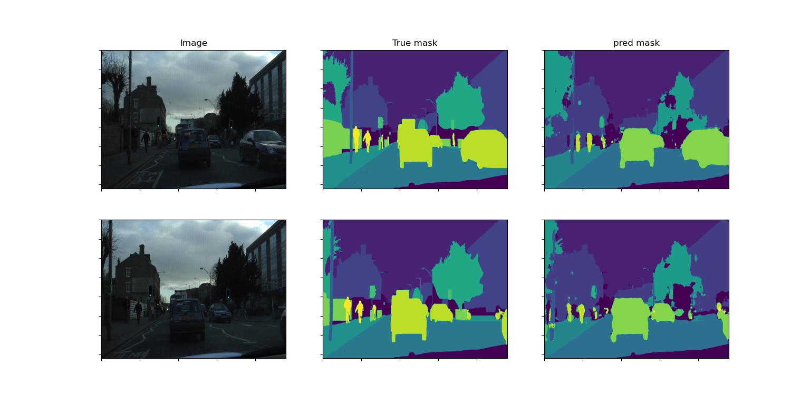
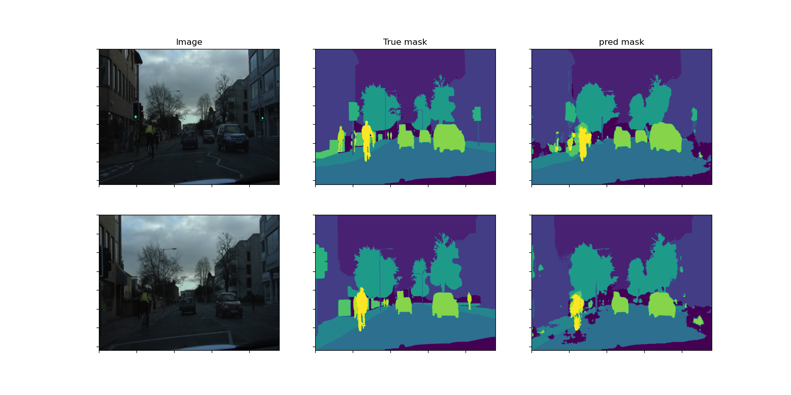

# Keras-Semantic-Segmentation

Keras implementation of various Net and comparision of performance on [CamVid](http://mi.eng.cam.ac.uk/research/projects/VideoRec/CamVid/) and [Cityscapes](https://www.cityscapes-dataset.com/)  dataset.

|Model Name   |  Dataset          | Classes <sup>1</sup> | Input resolution | Batch size | Mean IoU (%) | Accuracy (val) ||
|:------------|:----------------:|:--------------------:|:----------------:|:----------:|:------------:|:------------:|
| LinkNet     | CamVid            |        12          |      960x480     |      2     |     47.15   |                |
| LinkNet     | Cityscapes        |          20          |     960x480   |      2     |     53.37    |                |

<sup>1</sup> Includes the unlabeled/void class.<br/>

Example Results:
  



## Installation

1. Python 3 and pip.
2. Set up a virtual environment (optional, but recommended).
3. Install dependencies using pip: ``pip install -r requirements.txt``.


## Usage

Run [``main.py``](https://github.com/AvishekParajuli/Keras-semantic-segmentaion/blob/master/main.py), the main script file used for training and/or testing the model. The following options are supported:

```
python main.py [-h] [--mode {train,test,full}] [--resume]
               [--initial-epoch INITIAL_EPOCH] [--no-pretrained-encoder]
               [--weights-path WEIGHTS_PATH] [--batch-size BATCH_SIZE]
               [--epochs EPOCHS] [--learning-rate LEARNING_RATE]
               [--lr-decay LR_DECAY] [--lr-decay-epochs LR_DECAY_EPOCHS]
               [--dataset {camvid,cityscapes}] [--dataset-dir DATASET_DIR]
               [--workers WORKERS] [--verbose {0,1,2}] [--name NAME]
               [--checkpoint-dir CHECKPOINT_DIR]
```

For help on the optional arguments run: ``python main.py -h``


### Examples: Training

```
python main.py -m train --checkpoint-dir save/folder/ --name model_name --dataset name --dataset-dir path/root_directory/
```


### Examples: Resuming training

```
python main.py -m train --resume True --initial-epoch 10 --checkpoint-dir save/folder/ --name model_name --dataset name --dataset-dir path/root_directory/
```


### Examples: Testing

```
python main.py -m test --checkpoint-dir save/folder/ --name model_name --dataset name --dataset-dir path/root_directory/
```


## Project structure

### Folders

- [``data``](https://github.com/AvishekParajuli/Keras-semantic-segmentaion/tree/master/data): Contains code to load the supported datasets.
- [``metrics``](https://github.com/AvishekParajuli/Keras-semantic-segmentaion/tree/master/metric): Evaluation-related metrics.
- [``models``](https://github.com/AvishekParajuli/Keras-semantic-segmentaion/tree/master/models): LinkNet model definition.
- [``checkpoints``](https://github.com/AvishekParajuli/Keras-semantic-segmentaion/tree/master/checkpoints): By default, ``main.py`` will save models in this folder. The pre-trained encoder (ResNet18) trained on ImageNet can be found here.

### Files

- [``args.py``](https://github.com/AvishekParajuli/Keras-semantic-segmentaion/blob/master/arg.py): Contains all command-line options.
- [``main.py``](https://github.com/AvishekParajuli/Keras-semantic-segmentaion/blob/master/main.py): Main script file used for training and/or testing the model.
- [``callbacks.py``](https://github.com/AvishekParajuli/Keras-semantic-segmentaion/blob/master/callbacks.py): Custom callbacks are defined here.

## References:
- [*LinkNet: Exploiting Encoder Representations for Efficient Semantic Segmentation*](https://arxiv.org/abs/1707.03718)
- SegNet
- Unet
